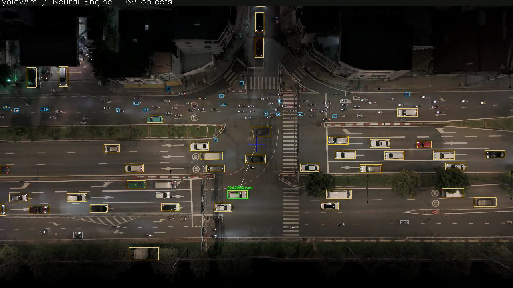
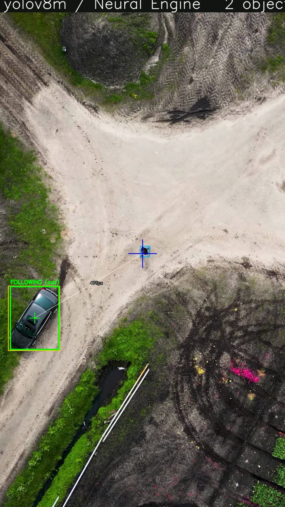

# Drone Vision — Real-Time Aerial Person & Vehicle Tracking and Following

An end-to-end computer-vision system for drones: it **detects** people and
vehicles from an aerial view with a custom-trained YOLOv8 model, **follows** a
chosen target through clutter and brief occlusions, measures its **speed and
size**, and can aim a camera gimbal or command an ArduPilot aircraft to orbit
it — running in real time on a laptop, a Raspberry Pi, or an Apple Neural Engine.


<sub>yolov8m detecting ~70 vehicles and pedestrians per frame in a busy
intersection, running on the Apple Neural Engine.</sub>

## Highlights

- **Custom detector** — fine-tuned **YOLOv8m on VisDrone** (aerial people +
  vehicles, 6,471 images, 10 classes): **mAP@50 0.42** (car AP **0.81**), up
  from 0.30 for the nano baseline.
- **Real-time on the Apple Neural Engine** — CoreML inference at **~43 ms
  (~23 FPS)**, **6.2× faster** than ONNX-on-CPU, with exact detection parity.
- **Drift-proof following** — detection-assisted tracking that re-locks to fresh
  detections instead of drifting onto the background, and reports a genuine
  *lost* instead of silently tracking nothing.
- **Re-identification through occlusion** — when the target is briefly hidden it
  **coasts on its last velocity for up to 15 s** and re-locks the *same* object
  by colour + predicted position + size + class (rejecting look-alikes).
- **Target analytics** — live **speed (mph)** and **real-world size** (metres),
  the latter from a scene scale inferred from known-size vehicles as rulers.
- **Tiled inference** for dense/4K frames: **+113%** more small objects
  recovered on a crowded 4K clip.
- **Deploys anywhere** — one codebase runs on a laptop, a Raspberry Pi (ONNX,
  no PyTorch), or a Mac (CoreML), with a CLI, a multi-camera web panel, and a
  conservative **ArduPilot / MAVLink** gimbal-aim and orbit-follow integration.

## Demo


<sub>Detection-assisted follow: the green box locks the moving car, the white
line to the blue screen-centre cross is the tracking error that drives the
gimbal / orbit command; a pedestrian is detected at the same time.</sub>

## Results

| Model (VisDrone, 640²) | mAP@50 | mAP@50-95 | Params | Inference |
|---|---|---|---|---|
| YOLOv8n (baseline) | 0.30 | 0.17 | 3.2 M | ~40 ms CPU (ONNX) |
| **YOLOv8m** | **0.42** | **0.25** | 25.9 M | **~43 ms ANE / 264 ms CPU** |

| Technique | Effect |
|---|---|
| CoreML → Apple Neural Engine | **6.2×** faster than ONNX-CPU (43 vs 264 ms) |
| Tiled inference (dense 4K) | **+113%** detections (69.8 → 148.6 / frame) |
| Validation across 6 real aerial clips | **~70,000** detections, 100% frame coverage on well-scaled footage |

Training: YOLOv8m converged in **3.6 h on a free Colab T4** (also runs on a
CPU server via a resumable systemd pipeline).

## How it works

```
camera / RTSP / video ─┬─ MediaPipe pose ─────── people (face + torso crosses)
                       └─ YOLOv8 detector ─────── vehicles + people (boxes)
                              │  ONNX Runtime (CPU/Pi) or CoreML (Neural Engine)
                              ▼
                    ObjectFollower  (active → coasting → lost state machine)
                      • CSRT tracker between detections
                      • re-lock to fresh detections (no drift)
                      • velocity → speed (mph)   • scene scale → size (m)
                      • colour signature → re-identify after occlusion
                              ▼
                    MAVLink / ArduPilot  — gimbal aim or orbit-follow (safety-gated)
```

## Tech stack

Python · OpenCV · MediaPipe · **Ultralytics YOLOv8** · **ONNX Runtime** ·
**CoreML / coremltools** (Apple Neural Engine) · NumPy / SciPy · Flask
(multi-camera web UI) · **pymavlink / MAVLink** (ArduPilot).

## Repo map

| Path | What |
|------|------|
| [`tracker.py`](tracker.py) | Desktop/CLI tracker + follower (speed, size, re-id) |
| [`app.py`](app.py) | Multi-camera web control panel (RTSP, auto-best view) |
| [`detector.py`](detector.py) | YOLOv8 detector via ONNX Runtime (+ tiled inference) |
| [`coreml_detector.py`](coreml_detector.py) | YOLOv8 on the Apple Neural Engine (CoreML) |
| [`motion.py`](motion.py) · [`size.py`](size.py) · [`appearance.py`](appearance.py) | Speed (mph), real-world size, occlusion re-identification |
| [`uav.py`](uav.py) · [`geo.py`](geo.py) | MAVLink gimbal/orbit + camera→ground geo-projection |
| [`colab/`](colab) | Colab notebook to train YOLOv8m on a free GPU |
| [`ardupilot_build/`](ardupilot_build) | Custom ArduPilot firmware config |
| [`test_*.py`](.) | Hardware-free test suites (detector, speed, size, re-id, distance, UAV, flight) |
| [`docs/`](docs) | Architecture, usage, parts, and safety documentation |

## Quick start

```bash
pip install -r requirements.txt

python3 tracker.py                              # webcam pose tracker
python3 app.py                                  # web panel at http://127.0.0.1:5000

# detection-assisted, drift-proof following (auto-uses the Neural Engine on a Mac):
python3 tracker.py --detector --camera aerial_clip.mp4
python3 tracker.py --detector --detect-tiles 2x2 --detect-classes car,van,truck,bus
```

See [docs/USAGE.md](docs/USAGE.md) for cameras, UAV, tiling, and all options.

## Tests

```bash
python3 test_detector.py   # detector, tiling, CoreML, re-lock logic
python3 test_speed.py      # velocity / mph
python3 test_size.py       # scene-scale size estimation
python3 test_reid.py       # occlusion coasting + re-identification
python3 test_distance.py test_uav.py test_flight.py
```

## Docs

- [Architecture](docs/ARCHITECTURE.md) · [Usage](docs/USAGE.md) ·
  [Parts](docs/PARTS.md) · [Safety](docs/SAFETY.md)

> **Safety:** this is a follow/filming platform — it orbits a subject at a
> standoff distance and never flies at it. All aircraft commands are gated
> (armed + GUIDED only, geofenced, RC always overrides). Validate in simulation
> before flight — see [docs/SAFETY.md](docs/SAFETY.md).

---

<sub>Detector trained on the VisDrone2019 dataset. Demo footage is royalty-free
stock. Licensed under [MIT](LICENSE).</sub>
